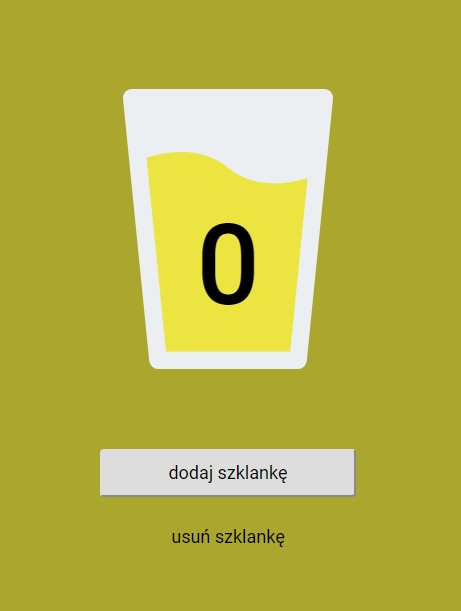
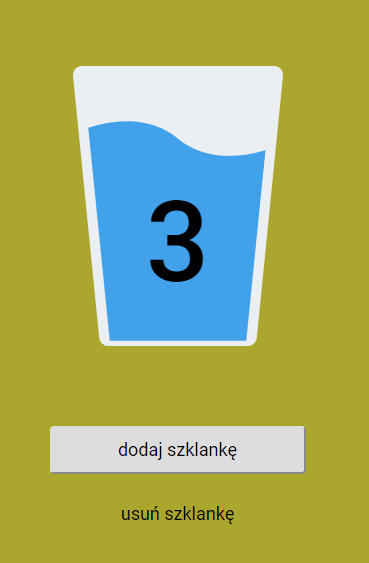

# Drink your water

Remember to #drinkyourwater. (# inspired by [Browney](https://www.youtube.com/channel/UC0r_-7jgl1yl0oWzGEJ6o3w))

## Overview
Simple PWA app, written during [WTF Course](https://cotenfrontend.pl/), to learn about html, css, js and pwa.

App counts glasses of water drank every day. Clicking on buttons changes amount of glasses and save it into web browser's local storage.


Check it out [here](https://raviraven.github.io/html-wtf-drink-your-water/).

## Screenshots




## How to run
1. Make sure you have npm installed
2. Download or clone project
3. Install npm modules, by running 

    ```
    npm install
    ```
    in cmd, in project directory

4. Then run gulp using command:

    ```
    gulp
    ```

5. Enter url shown in command line into the browser
6. That's it! 😊